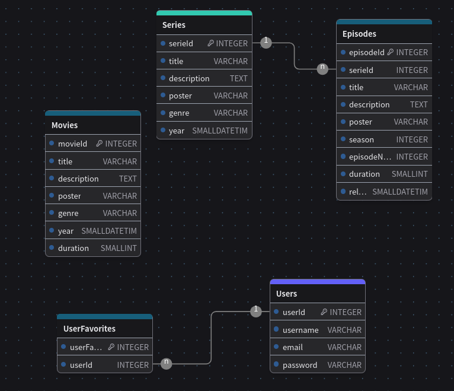

# Back End - API Service

Welcome to the Back End project for the "MegaHub" project.

The goal for this service is to directly consume the Database.

Implementation:
- Node Js
- Express Js
- Microsoft SQL Server 2022

## Project start:

Install dependencies, on the Terminal:
```
  npm install
```

Server PORT = 3001

APIs:
```
GET Users -> http://localhost:3001/users
GET User by id -> http://localhost:3001/users/id

GET Movies -> http://localhost:3001/movies
GET Movie by id -> http://localhost:3001/movies/id

```


## Database

Implementing `Microsoft SQL Server 2022`.

### E-R Diagram




### Feedback

| ¿Qué salió bien? | ¿Qué puedo hacer diferente? | ¿Qué no salió bien?
| ------ | ----------- | ----------- |
| - Module creation | - API responses | - Deliver on time
| - MS SQL Database Implementation  | - Time management | - Time management
| - Backend connection with DB | - Tables normalization | - Connection with frontend