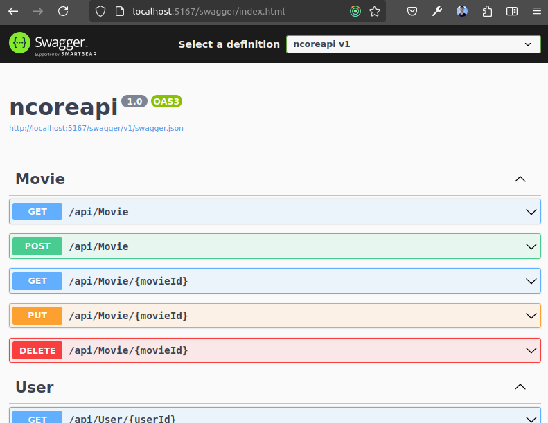
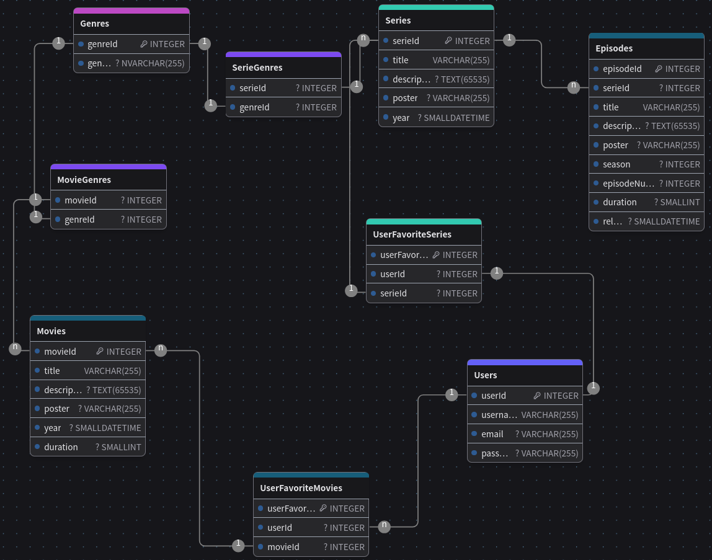

# API Service - NCoreAPI

Welcome to the Web API Service for "MegaHub" project.

The goal for this service is to provide an API to directly consume the Database (DB).

Implementation:
- .NET Core API
- Microsoft SQL Server 2022
- Swagger

### Project configuration:
You need to add the following configuration in your `appsettings.json` file to set up the Database connection:

```
  "ConnectionStrings": {
    "DefaultConnection": "Server=ReplaceWithYourServerName;Database=Megahubdb;User Id=ReplaceWithYourUserId;Password=ReplaceWithYourPassword;TrustServerCertificate=true;"
  }
```
Replace with your cretentials; database name must be the same as created. [See Db section](##-Database).

### Project start:

Running the project, on the Terminal:
```
  dotnet run
```


---

## APIs

Find below the different API Methods related to the entities:

Feel free to use `Swagger` to impelemnt the different HTTP methods.

Access the url provided on the Terminal after running the program, add the path `/swagger`:
```
http://localhost:5167/swagger
```




---


## Database

Implementing `Microsoft SQL Server 2022`.

Database name: `Megahubdb`.

Normalization:
- Genre table
- User Favorites tables, for:
  - Movies
  - Series

Find the `.sql` project, for DB creation and configuration, files in the [database directory](/ncoreapi/database/).


### E-R Diagram



*This is a reviewed and normalized version of previous Database created for previous Sprint.*


### Feedback

| ¿Qué salió bien? | ¿Qué puedo hacer diferente? | ¿Qué no salió bien?
| ------ | ----------- | ----------- |
| - API Rest | - Path directories | - Full coverage on tables methods
| - MS SQL DB Implementation  | - Code Refactor | - Time management
| - API connection with DB | - Class naming convention | - Frontend connection